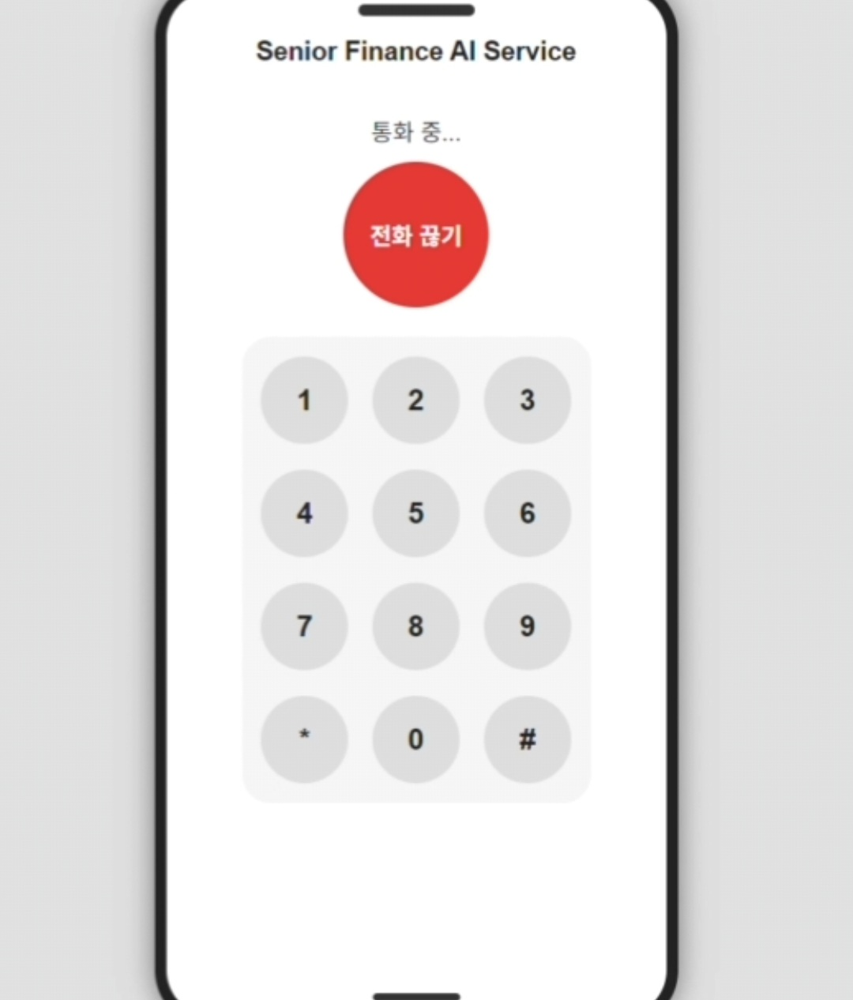
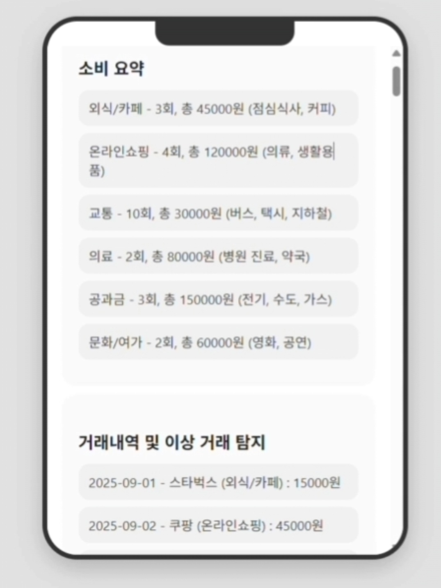
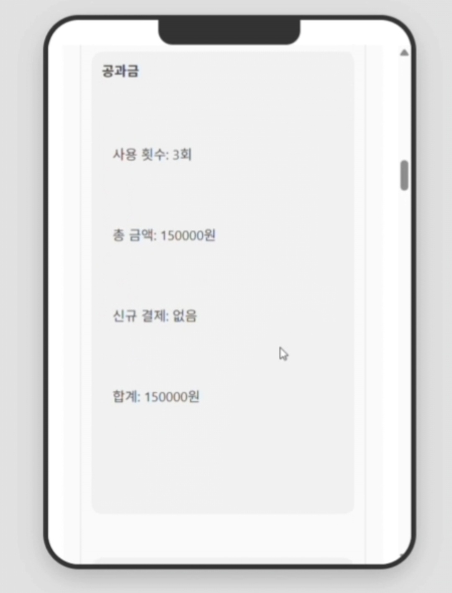
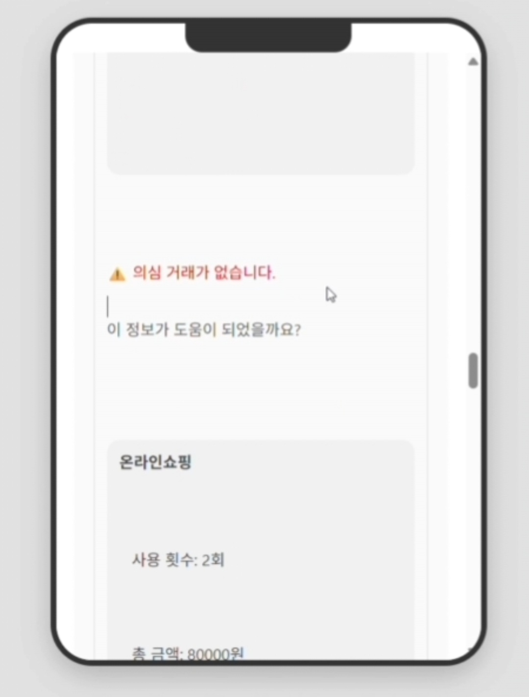

# Senior-Finance-Assistant
AI assistant helping seniors manage finance via voice, image, and real-time phishing alerts.

**1. 프로젝트 소개 (Project Overview)**
시니어를 위한 금융 AI 어시스턴트. 카드 사용 내역 분석, 보이스피싱 경고, OCR 기반 고지서 텍스트 추출 지원.

**2. 주요 기능 (Features)**

음성(STT) 변환: Whisper

지출 분석, 추천 카드, 거래 내역 요약

OCR(고지서 이미지 텍스트 추출) → Tesseract 사용

RAG 기반 GPT 답변

**3. 설치 및 환경 설정 (Installation & Setup)**

Python 버전

필수 패키지 (requirements.txt 혹은 pip install -r requirements.txt)

환경변수 설정:

OpenAI API key

ffmpeg 경로 (음성 기능 사용 시 필요)

Tesseract 경로 (OCR 사용 시 필요)

**4. 데이터 준비 (Data)**

sample_data.json 예시 위치

OCR용 이미지 위치(SERVER_IMAGE_PATH)

Tesseract 학습데이터 위치

**5. 실행 방법 (Usage)**

음성 기능 → ffmpeg 필요, 공식 홈페이지에서 다운 후 파일에 넣고 실행
https://ffmpeg.org/?utm_source=chatgpt.com

터미널에서 실행
python -m uvicorn app:app --reload --host 0.0.0.0 --port 8000

그 후 접속
http://127.0.0.1:8000/

  
  
  

